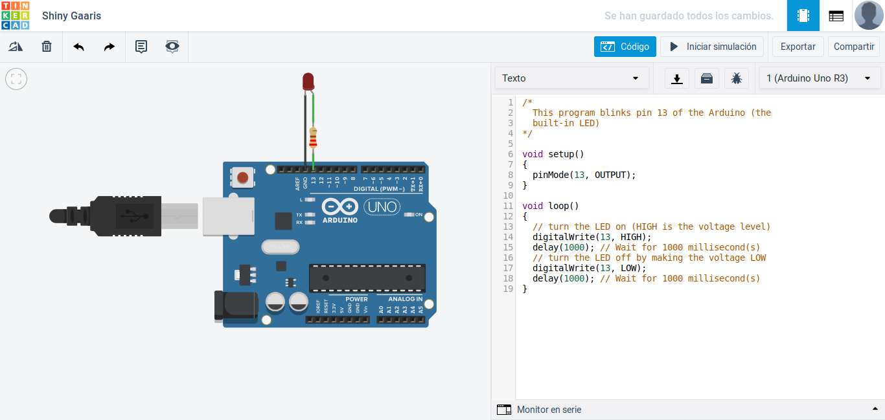
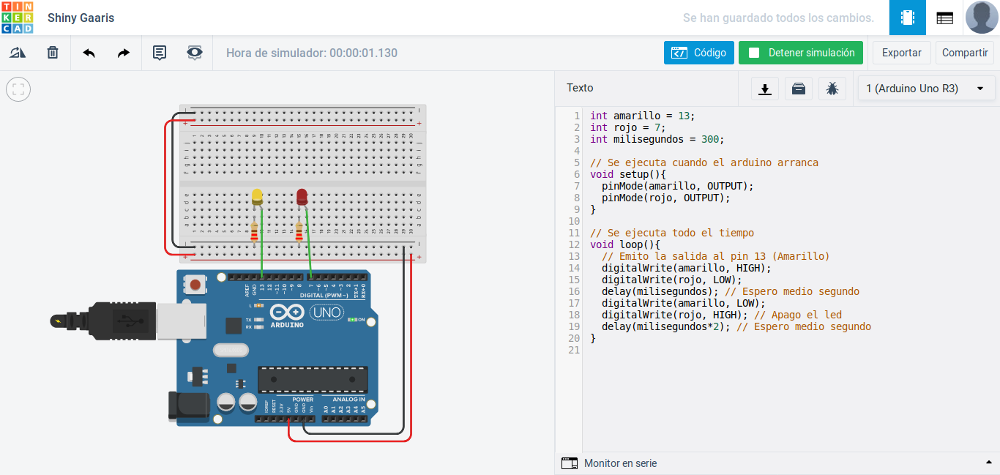

# ¿Cómo programar un Arduino?

Para eso usamos el IDE de arduino, lo instalamos desde la página oficial y escribimos nuestro primer programa para hacer parpadear un led.

En el caso de no contar con la placa y los componentes, podemos usar simuladores para poder programar eso. Lo podemos realizar con [Tinkercad](https://www.tinkercad.com/circuits) que es una herramienta gratuita para poder simular nuestro proyecto.

Para eso, debemos crear una cuenta y con eso ya podemos usar el programa de forma gratuita.







El lenguaje con el que se programa los arduinos de llama **Scketch** que es una derivación de **C**. La mayoría de los sistemas operativos están programados en el lenguaje C.

## ¿Cómo programar un Arduino con Javascript y Node?

Para programar en arduino con Javascript se debe instalar algo llamado "firmware". Que es una serie de instrucciones en C, que permiten al arduino conectarse a nodeJS y javascript. Los navegadores no tienen acceso al puerto USB, porque la intención de la web es que funcione en internet.

Programas a instalar

- [Jonny-Five](http://johnny-five.io/) es una librería para conectarse a arduino y poder programar arduinos. Hay varias placas con soporte

Instalamos Jonny-Five en nuestro proyecto (Directorio)

- `npm install johnny-five`

Para poder usar nodeJS en arduino,debemos subirle al arduino el código que permite conectarse a nodeJS

**File -> examples -> Firmata -> StandartFirmata**

Luego debemos subirlo al arduino, lo que hará este programa es comunicarse en tiempo real por el puerto usb con Jonny-Five.

Ahora ya podemos programar usando arduino

Creamos un archivo llamado `leds.js` y ejecutamos el comando 

- `node leds.js`

Con eso ya el código se carga en el arduino

- `node banderita.js`


**Ver http://jsforcats.com/**

Ejemplo de uso de XOR (O exclusivo);

```js
lluvia = true;
sombrilla = true;
bajo_techo = true;

if (lluvia){
    // Si tengo sombrilla y no estoy bajo techo (Lo contrario también aplica)
    if (sombrilla ^ bajo_techo){
        alert("Estás en lo correcto");
    } else {
        alert("¿Dónde te equivocaste?");
    }
} else {
    alert("No necesitas sombrilla");
}
```